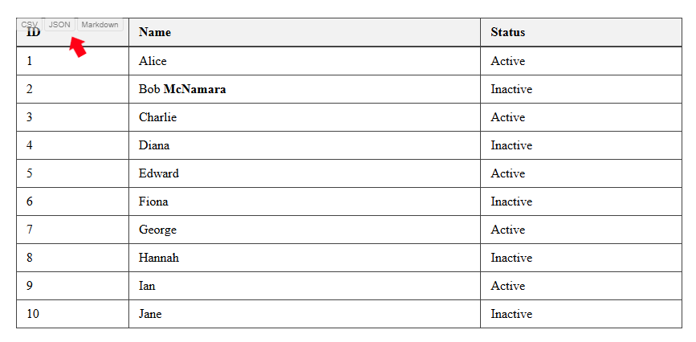

# Website Table Exporter

A browser extension that automatically adds export functionality to HTML tables on any website. Export tables to CSV, JSON, or Markdown format with a single click.



## ✨ Features

- **Universal compatibility**: Works on any website with HTML tables
- **Multiple export formats**: CSV, JSON, and Markdown
- **One-click export**: Export buttons appear automatically on all tables
- **Toggle button visibility**: Hide/show export buttons via extension popup
- **Clipboard integration**: Exported data is copied directly to your clipboard
- **Dynamic table support**: Automatically detects and adds buttons to tables created with JavaScript
- **Merged cell detection**: Warns users when tables contain merged cells that may affect export quality
- **Clean formatting**: Properly handles line breaks, special characters, and escaping

### Example Output

**CSV Format:**
```
"Name","Age","City"
"John Doe","30","New York"
"Jane Smith","25","Los Angeles"
```

**JSON Format:**
```json
[
  {
    "Name": "John Doe",
    "Age": "30",
    "City": "New York"
  },
  {
    "Name": "Jane Smith",
    "Age": "25",
    "City": "Los Angeles"
  }
]
```

**Markdown Format:**
```markdown
| Name | Age | City |
| --- | --- | --- |
| John Doe | 30 | New York |
| Jane Smith | 25 | Los Angeles |
```

## 🚀 Installation

### Google Chrome

1. **Install from Chrome Web Store** (when published):
   - Visit the Chrome Web Store
   - Search for "Website Table Exporter"
   - Click "Add to Chrome"

2. **Manual Installation** (for development):
   - Download or clone this repository
   - Open Chrome and navigate to `chrome://extensions/`
   - Enable "Developer mode" (toggle in top right)
   - Click "Load unpacked" and select the extension folder

### Mozilla Firefox

1. **Install from Firefox Add-ons** (when published):
   - Visit Firefox Add-ons store
   - Search for "Website Table Exporter"
   - Click "Add to Firefox"

2. **Manual Installation** (for development):
   - Download or clone this repository
   - Open Firefox and navigate to `about:debugging`
   - Click "This Firefox" in the left sidebar
   - Click "Load Temporary Add-on"
   - Select the `manifest.json` file from the extension folder

## 📖 How to Use

### Basic Export Functionality
1. **Navigate to any webpage** containing HTML tables
2. **Export buttons appear automatically** on each table:
   - **CSV**: Export as comma-separated values
   - **JSON**: Export as JSON array with header-based keys
   - **Markdown**: Export as Markdown table format
3. **Click any export button** to copy the data to your clipboard
4. **Paste the data** into your preferred application

### Toggle Button Visibility
1. **Click the extension icon** in your browser's toolbar to open the popup
2. **Click "Hide buttons"** to hide all export buttons from tables on the current page
3. **Click "Show buttons"** to make the buttons visible again
4. **Note**: This setting resets when the page is refreshed - it does not persist between page loads

## 🎯 Use Cases

- **Data Analysis**: Quickly export website tables for analysis in Excel, Google Sheets, or other tools
- **Documentation**: Convert HTML tables to Markdown for documentation or README files
- **Research**: Extract data from research papers, reports, or statistical websites
- **Content Migration**: Move tabular data between different platforms and formats
- **API Development**: Export table data as JSON for testing or development purposes
- **Academic Work**: Extract data from academic databases and online resources

## ⚠️ Important Notes

- **Merged Cells**: Tables with merged cells (colspan/rowspan) will show a warning message, as the exported data may not be completely reliable
- **Dynamic Tables**: The extension automatically detects tables added to the page after initial load
- **Button Visibility**: The hide/show toggle only affects the current page and resets on page reload
- **Privacy**: The extension only accesses the current active tab and doesn't collect any personal data

## 🔧 Technical Details

- **Manifest Version**: 3
- **Permissions**: `activeTab`, `clipboardWrite`
- **Content Script**: Runs on all websites (`<all_urls>`)
- **Browser Compatibility**: Chrome, Firefox, and other Chromium-based browsers

## 🤝 Contributing

Contributions are welcome! Please feel free to submit issues, feature requests, or pull requests.

## 📝 License

This project is open source. Please check the license file for more details.

## 👨‍💻 Author

**Lawrence Lagerlof**
- GitHub: [@llagerlof](https://github.com/llagerlof)
- Project: [websitetableexporter](https://github.com/llagerlof/websitetableexporter)

---

*Made with ❤️ for developers, researchers, and data enthusiasts*
